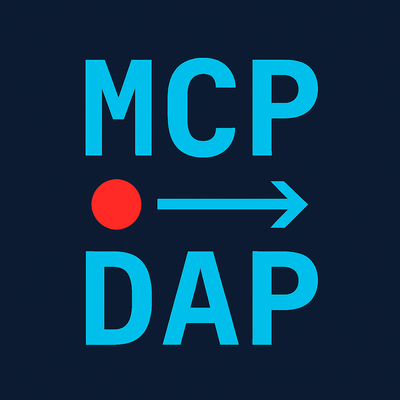

# mcp-debugger

<div align="center">
  
</div>

**A headless, agentic debugger over MCP — let your AI agents debug running programs in eight languages.**

[](https://github.com/debugmcp/mcp-debugger/actions/workflows/ci.yml)
[](https://codecov.io/gh/debugmcp/mcp-debugger)
[](https://www.npmjs.com/package/@debugmcp/mcp-debugger)
[](https://hub.docker.com/r/debugmcp/mcp-debugger)
[](./LICENSE)
[](https://scorecard.dev/viewer/?uri=github.com/debugmcp/mcp-debugger)
[](https://www.bestpractices.dev/projects/13543)

## 🎯 Overview

mcp-debugger is a Model Context Protocol (MCP) server that exposes step-through debugging as structured tool calls. It lets AI agents set breakpoints, inspect variables, evaluate expressions, and step through running programs across eight languages — driving real language debuggers through the Debug Adapter Protocol (DAP).

**No IDE required.** mcp-debugger runs anywhere Node.js runs: CI runners, Docker containers, Kubernetes pods, SSH boxes, and the sandboxes that cloud coding agents live in. It's the debugger for where IDEs can't go.

### When to use mcp-debugger vs an IDE-bound debug server

Microsoft's [DebugMCP](https://github.com/microsoft/DebugMCP) exposes VS Code's debugger over MCP and is a good choice when your agent works *inside* a running VS Code. The two projects make different structural trade-offs:

| | mcp-debugger | microsoft/DebugMCP |
|---|---|---|
| Runs headless (CI, containers, k8s, cloud agents) | ✅ standalone Node process | ❌ requires a running VS Code |
| Transports | stdio + Streamable HTTP | Streamable HTTP (localhost) |
| Distribution | npx, npm, Docker image | VS Code Marketplace extension |
| Remote attach without an IDE | ✅ debugpy / rdbg / JDWP, incl. pods via port-forward | ❌ |
| Per-session process isolation | ✅ one proxy process per session | shares the VS Code instance |
| Java hot-swap (`redefine_classes`) | ✅ | ❌ |
| Debuggee output as subscribable MCP resource | ✅ | ❌ |
| In-IDE debugging UX alongside the agent | ✅ read-only IDE mirror (`expose_session`, [#217](https://github.com/debugmcp/mcp-debugger/issues/217)) | ✅ native |
| C/C++ | ✅ via CodeLLDB (launch + attach-by-PID) | ✅ via VS Code extensions |
| PHP | ❌ | ✅ via VS Code extensions |
| Languages | Python, JS/TS, Ruby, Rust, Go, Java, .NET, C/C++ | Python, JS/TS, Ruby, Rust, Go, Java, .NET, C/C++, PHP |

If your agent runs in a terminal, a pipeline, or a cloud sandbox — or needs to attach to a process on another machine — you want mcp-debugger.

> 🆕 **v0.22.0** — **Ruby debugging support** lands (launch + attach via `rdbg`, including remote attach to containers and Kubernetes pods), alongside JavaScript attach-mode fixes and session/proxy lifecycle hardening. See the [CHANGELOG](./CHANGELOG.md) for the full release history.

## ✨ Key Features

- 🌐 **Multi-language support** – Clean adapter pattern for any language
- 🐍 **Python debugging via debugpy** – Full DAP protocol support
- 💎 **Ruby debugging via rdbg** – Launch and attach workflows, including remote attach to containers and Kubernetes pods
- 🟨 **JavaScript (Node.js) debugging via js-debug** – VSCode's proven debugger
- 🦀 **Rust debugging via CodeLLDB** – Debug Rust & Cargo projects (Linux/macOS; Windows needs the GNU toolchain — see [Rust on Windows](docs/rust-debugging-windows.md))
- 🐹 **Go debugging via Delve** – Full DAP support for Go programs
- ☕ **Java debugging via JDI bridge** – Launch and attach modes with JDK 21+
- 🔷 **.NET/C# debugging via netcoredbg** – Debug .NET applications with full DAP support
- ⚙️ **C/C++ debugging via CodeLLDB** – Launch prebuilt binaries or lone source files (auto-compiled), attach by PID; core dumps and gdbserver/rr targets via config pass-through
- 🧪 **Mock adapter for testing** – Test without external dependencies
- 🛰️ **Out-of-IDE & remote attach** – Attach over host/port to a process on another machine or inside a container (Python via debugpy, Ruby via rdbg, Java via JDWP), with source-path mapping
- 🔌 **STDIO and Streamable HTTP transports** – Works with any MCP client (legacy SSE transport is deprecated)
- 📦 **Zero-runtime dependencies** – Self-contained bundles via esbuild + tsup
- ⚡ **npx ready** – Run directly with `npx @debugmcp/mcp-debugger` - no installation needed
- 🐳 **Docker and npm packages** – Deploy anywhere
- 🤖 **Built for AI agents** – Structured JSON responses for easy parsing
- 🔒 **Secret redaction on by default** – Credential-shaped values (API keys, tokens, private keys) are masked as labeled placeholders in variable, evaluate, and output results before they reach the agent ([details](./docs/tool-reference.md#secret-redaction); opt out with `DEBUG_MCP_NO_REDACT=1`)
- 🛡️ **Path validation** – Prevents crashes from non-existent files
- 📝 **AI-aware line context** – Intelligent breakpoint placement with code context
- ✅ **Comprehensive test suite** – unit, integration, and end-to-end coverage across every adapter ([CI status](https://github.com/debugmcp/mcp-debugger/actions/workflows/ci.yml))

## 🧠 Agent Skill

Tools tell an agent *what* it can do; a skill teaches it *how to debug well*. This repo ships an [agent skill](skills/debugging/) covering the session golden path, root-cause discipline (bisection over line-by-line stepping), attach/remote recipes, and per-language quirks:

```bash
# Claude Code (user-level)
cp -r skills/debugging ~/.claude/skills/mcp-debugger
# Cross-agent directories (Copilot CLI and friends)
cp -r skills/debugging ~/.agents/skills/mcp-debugger
```

The server also serves condensed guidance in-band: MCP `instructions` on connect, plus a `debugging-workflow` prompt any MCP client can request. See [skills/debugging/README.md](skills/debugging/README.md) for details.

## 🚀 Quick Start

> **Requirements:** Node.js 22+ for the server. Each language you debug also needs its own toolchain installed (Python + debugpy, Ruby + the `debug` gem / `rdbg`, Node.js, Go + Delve, JDK 21+, .NET SDK, the Rust toolchain, or a C/C++ compiler — g++/clang++, only needed for source-file launch).

### For MCP Clients (Claude Desktop, etc.)

Add to your MCP settings configuration:

```json
{
  "mcpServers": {
    "mcp-debugger": {
      "command": "node",
      "args": ["C:/path/to/mcp-debugger/dist/index.js", "stdio", "--log-level", "debug", "--log-file", "C:/path/to/logs/debug-mcp-server.log"],
      "disabled": false,
      "autoApprove": ["create_debug_session", "set_breakpoint", "get_variables"]
    }
  }
}
```

### For Claude Code CLI

For Claude Code users, we provide an automated installation script:

> **Prerequisite**: The Claude CLI must be installed and available on your PATH before running the installation script. See [Claude Code documentation](https://claude.ai/code) for installation instructions.

```bash
# Clone the repository
git clone https://github.com/debugmcp/mcp-debugger.git
cd mcp-debugger

# Run the installation script
./scripts/install-claude-mcp.sh

# Verify the connection (use 'claude mcp list' if claude is on your PATH)
claude mcp list
```

**Important**: The `stdio` argument is required to prevent console output from corrupting the JSON-RPC protocol. See [CLAUDE.md](CLAUDE.md) for detailed setup and troubleshooting.

### Using Docker

```bash
docker run -v $(pwd):/workspace debugmcp/mcp-debugger:latest
```

> ⚠️ The Docker image bundles the toolchains for **Python, JavaScript, and Java** debugging (Rust, Go, .NET, and C/C++ are disabled inside the container image, and the image does not include a Ruby runtime). For those languages, run the server via npm/npx next to your local toolchain — or, for Ruby, use remote attach to a `rdbg --open` process inside the container (see the [Ruby guide](./docs/ruby/README.md)). Adapters load dynamically at runtime — `list_supported_languages` reports only those whose toolchain is detected.

### Using npm

```bash
npm install -g @debugmcp/mcp-debugger
mcp-debugger --help
```

Or use without installation via npx:
```bash
npx @debugmcp/mcp-debugger --help
```

## 📚 How It Works

mcp-debugger exposes debugging operations as MCP tools that can be called with structured JSON parameters:

```json
// Tool: create_debug_session
// Request:
{
  "language": "python",  // or "ruby", "javascript", "rust", "go", "java", "dotnet", "cpp", or "mock" for testing
  "name": "My Debug Session"
}
// Response:
{
  "success": true,
  "sessionId": "a4d1acc8-84a8-44fe-a13e-28628c5b33c7",
  "message": "Created python debug session: My Debug Session"
}
```

## 🛠️ Available Tools

| Tool | Description | Status |
|------|-------------|--------|
| `create_debug_session` | Create a new debugging session | ✅ Implemented |
| `list_debug_sessions` | List all active sessions | ✅ Implemented |
| `list_supported_languages` | Show available language adapters | ✅ Implemented |
| `set_breakpoint` | Set a breakpoint in a file | ✅ Implemented |
| `list_breakpoints` | List a session's breakpoints with verified state | ✅ Implemented |
| `remove_breakpoint` | Remove a breakpoint by id or file+line | ✅ Implemented |
| `clear_breakpoints` | Remove all breakpoints (optionally per file) | ✅ Implemented |
| `start_debugging` | Start debugging a script | ✅ Implemented |
| `restart_debugging` | Relaunch with the same config, breakpoints re-applied | ✅ Implemented |
| `attach_to_process` | Attach debugger to a running process | ✅ Implemented |
| `detach_from_process` | Detach debugger from a process | ✅ Implemented |
| `expose_session` | Open a read-only DAP mirror endpoint so an IDE can attach and inspect | ✅ Implemented |
| `unexpose_session` | Close the mirror endpoint and disconnect IDE clients | ✅ Implemented |
| `get_stack_trace` | Get the current stack trace | ✅ Implemented |
| `list_threads` | List all threads in the debug session | ✅ Implemented |
| `get_scopes` | Get variable scopes for a frame | ✅ Implemented |
| `get_variables` | Get variables in a scope | ✅ Implemented |
| `get_local_variables` | Get local variables in current frame | ✅ Implemented |
| `step_over` | Step over the current line | ✅ Implemented |
| `step_into` | Step into a function | ✅ Implemented |
| `step_out` | Step out of a function | ✅ Implemented |
| `continue_execution` | Continue running | ✅ Implemented |
| `pause_execution` | Pause running execution | ✅ Implemented |
| `evaluate_expression` | Evaluate expressions in debug context | ✅ Implemented |
| `get_source_context` | Get source code context | ✅ Implemented |
| `get_output` | Read captured debuggee output (stdout/stderr) | ✅ Implemented |
| `close_debug_session` | Close a session | ✅ Implemented |
| `redefine_classes` | Hot-swap changed Java classes into a running JVM (Java only) | ✅ Implemented |

## 🏗️ Architecture: Dynamic Adapter Loading

Version 0.10.0 introduces a clean adapter pattern that separates language-agnostic core functionality from language-specific implementations:

```
┌─────────────┐     ┌────────────────┐     ┌──────────────┐     ┌─────────────────┐
│ MCP Client  │────▶│ DebugMcpServer │────▶│SessionManager│────▶│ AdapterRegistry │
└─────────────┘     └────────────────┘     └──────────────┘     └─────────────────┘
                            │                      │
                            ▼                      ▼
                    ┌──────────────┐      ┌─────────────────┐
                    │ ProxyManager │◀─────│ Language Adapter│
                    └──────────────┘      └─────────────────┘
                                                  │
              ┌───────────┬───────────┬───────────┼───────────┬───────────┬───────────┬───────────┐
              │           │           │           │           │           │           │           │
        ┌─────▼────┐┌─────▼────┐┌─────▼────┐┌─────▼────┐┌─────▼────┐┌─────▼────┐┌─────▼────┐┌─────▼────┐
        │Python    ││Ruby      ││JavaScript││Rust      ││Go        ││Java      ││.NET      ││Mock      │
        │Adapter   ││Adapter   ││Adapter   ││Adapter   ││Adapter   ││Adapter   ││Adapter   ││Adapter   │
        └──────────┘└──────────┘└──────────┘└──────────┘└──────────┘└──────────┘└──────────┘└──────────┘
```

### Adding Language Support

Want to add debugging support for your favorite language? Check out the [Adapter Development Guide](./docs/architecture/adapter-development-guide.md)!

## 💡 Example: Debugging Python Code

Here's a complete debugging session example:

```python
# buggy_swap.py
def swap_variables(a, b):
    a = b  # Bug: loses original value of 'a'
    b = a  # Bug: 'b' gets the new value of 'a'
    return a, b
```

### Step 1: Create a Debug Session

```json
// Tool: create_debug_session
// Request:
{
  "language": "python",
  "name": "Swap Bug Investigation"
}
// Response:
{
  "success": true,
  "sessionId": "a4d1acc8-84a8-44fe-a13e-28628c5b33c7",
  "message": "Created python debug session: Swap Bug Investigation"
}
```

### Step 2: Set Breakpoints

```json
// Tool: set_breakpoint
// Request:
{
  "sessionId": "a4d1acc8-84a8-44fe-a13e-28628c5b33c7",
  "file": "buggy_swap.py",
  "line": 2
}
// Response:
{
  "success": true,
  "breakpointId": "28e06119-619e-43c0-b029-339cec2615df",
  "file": "C:\\path\\to\\buggy_swap.py",
  "line": 2,
  "verified": false,
  "message": "Breakpoint set at C:\\path\\to\\buggy_swap.py:2"
}
```

### Step 3: Start Debugging

```json
// Tool: start_debugging
// Request:
{
  "sessionId": "a4d1acc8-84a8-44fe-a13e-28628c5b33c7",
  "scriptPath": "buggy_swap.py"
}
// Response:
{
  "success": true,
  "state": "paused",
  "message": "Debugging started for buggy_swap.py. Current state: paused",
  "data": {
    "message": "Debugging started for buggy_swap.py. Current state: paused",
    "reason": "breakpoint"
  }
}
```

### Step 4: Inspect Variables

First, get the scopes:

```json
// Tool: get_scopes
// Request:
{
  "sessionId": "a4d1acc8-84a8-44fe-a13e-28628c5b33c7",
  "frameId": 3
}
// Response:
{
  "success": true,
  "scopes": [
    {
      "name": "Locals",
      "variablesReference": 5,
      "expensive": false,
      "presentationHint": "locals",
      "source": {}
    },
    {
      "name": "Globals", 
      "variablesReference": 6,
      "expensive": false,
      "source": {}
    }
  ]
}
```

Then get the local variables:

```json
// Tool: get_variables
// Request:
{
  "sessionId": "a4d1acc8-84a8-44fe-a13e-28628c5b33c7",
  "scope": 5
}
// Response:
{
  "success": true,
  "variables": [
    {"name": "a", "value": "10", "type": "int", "variablesReference": 0, "expandable": false},
    {"name": "b", "value": "20", "type": "int", "variablesReference": 0, "expandable": false}
  ],
  "count": 2,
  "variablesReference": 5
}
```

## 📖 Documentation

- 📘 [Tool Reference](./docs/tool-reference.md) – Complete API documentation
- 🚦 [Getting Started Guide](./docs/getting-started.md) – First-time setup
- 🏗️ [Architecture Overview](./docs/architecture/README.md) – Multi-language design
- 🔧 [Adapter Development](./docs/architecture/adapter-development-guide.md) – Add new languages
- 🔌 [Dynamic Loading Architecture](./docs/architecture/dynamic-loading-architecture.md) – Runtime discovery, lazy loading, caching
- 🧩 [Adapter API Reference](./docs/architecture/adapter-api-reference.md) – Adapter, factory, loader, and registry contracts
- 🔄 [Migration Guide](./docs/migration-guide.md) – Upgrading to v0.15.0 (dynamic loading)
- 🐍 [Python Debugging Guide](./docs/python/README.md) – Python-specific features
- 💎 [Ruby Debugging Guide](./docs/ruby/README.md) – Ruby debugging with `rdbg`, including remote attach
- 🟨 [JavaScript Debugging Guide](./docs/javascript/README.md) – JavaScript/TypeScript features
- 🐹 [Go Debugging Guide](./docs/go/README.md) – Go debugging with Delve
- ☕ [Java Debugging Guide](./docs/java/README.md) – Java debugging with JDI bridge
- 🔷 [.NET Debugging Guide](./docs/dotnet/README.md) – .NET/C# debugging with netcoredbg
- [Rust Debugging on Windows](docs/rust-debugging-windows.md) - Toolchain requirements and troubleshooting
- 🔧 [Troubleshooting](./docs/troubleshooting.md) – Common issues & solutions

## 🤝 Contributing

We welcome contributions! See [CONTRIBUTING.md](./CONTRIBUTING.md) for guidelines.

```bash
# Development setup
git clone https://github.com/debugmcp/mcp-debugger.git
cd mcp-debugger

# Install dependencies and vendor debug adapters
pnpm install
# All debug adapters (JavaScript js-debug, Rust CodeLLDB) are automatically downloaded

# Build the project
pnpm build

# Run tests
pnpm test

# Check adapter vendoring status
pnpm vendor:status

# Force re-vendor all adapters (if needed)
pnpm vendor:force
```

### Debug Adapter Vendoring

The project automatically vendors debug adapters during `pnpm install`:
- **JavaScript**: Downloads Microsoft's js-debug from GitHub releases
- **Rust**: Downloads CodeLLDB binaries for the current platform
- **CI Environment**: Set `SKIP_ADAPTER_VENDOR=true` to skip vendoring

To manually manage adapters:
```bash
# Check current vendoring status
pnpm vendor:status

# Re-vendor all adapters
pnpm vendor

# Clean and re-vendor (force)
pnpm vendor:force

# Clean vendor directories only
pnpm clean:vendor
```

### Running Container Tests Locally

We use [Act](https://github.com/nektos/act) to run GitHub Actions workflows locally:

```bash
# Build the Docker image first
docker build -t mcp-debugger:local .

# Run tests with Act (use WSL2 on Windows)
act -j build-and-test --matrix os:ubuntu-latest
```

See [tests/README.md](./tests/README.md) for detailed testing instructions.

## 📊 Project Status

- ✅ **Production Ready**: v0.22.0 with eight language adapters and polished multi-language distribution
- ✅ **Clean architecture** with a dynamic adapter pattern
- ✅ **Python · Ruby · JavaScript/TypeScript · Go · Java · .NET/C#**: Full step-through debugging
- 🦀 **Rust**: Full support on Linux/macOS/Windows (Windows requires the GNU toolchain; MSVC is not supported by CodeLLDB)
- ⚙️ **C/C++**: Full step-through debugging via CodeLLDB (launch + attach-by-PID; on Windows prefer MinGW/DWARF — MSVC PDB fidelity is partial)
- 🟢 **Runtime**: Node.js 22+
- 📈 **Active Development**: Regular updates and improvements

## 🏛️ Who Maintains This

mcp-debugger is stewarded by **Sycamore LLC** and led by John Franklin ([@debugmcpdev](https://github.com/debugmcpdev)). The project uses an agent-first development model with human accountability: AI agents write most of the code; a human maintainer makes every merge, release, and security decision. See [MAINTAINERS.md](./MAINTAINERS.md), [GOVERNANCE.md](./GOVERNANCE.md), and [SUPPORT.md](./SUPPORT.md) (including commercial support).

Supply-chain posture: pinned CI actions, OIDC trusted publishing, sigstore provenance on every npm package, SBOMs attached to releases, and an [OpenSSF Scorecard](https://scorecard.dev/viewer/?uri=github.com/debugmcp/mcp-debugger) score we actively maintain — details in [SUPPLY-CHAIN-SECURITY.md](./SUPPLY-CHAIN-SECURITY.md). Report vulnerabilities via [SECURITY.md](./SECURITY.md).

## 📄 License

MIT License - see [LICENSE](./LICENSE) for details.

## 👥 Contributors

- [@Poyraxx](https://github.com/Poyraxx) — Ruby adapter (rdbg)
- [@swinyx](https://github.com/swinyx) — Go adapter (Delve)
- [@roofpig95008](https://github.com/roofpig95008) — Java adapter (JDI bridge)

## 🙏 Acknowledgments

Built with:
- [Model Context Protocol](https://github.com/anthropics/model-context-protocol) by Anthropic
- [Debug Adapter Protocol](https://microsoft.github.io/debug-adapter-protocol/) by Microsoft
- [debugpy](https://github.com/microsoft/debugpy) for Python debugging
- [debug](https://github.com/ruby/debug) for Ruby debugging

---

**Give your AI agents a real debugger — in any language.**
