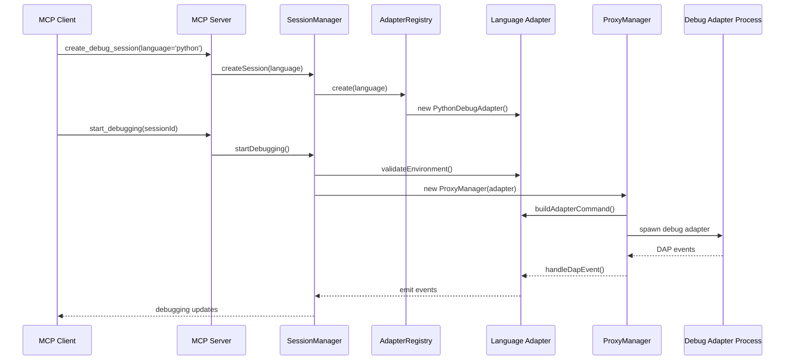

# mcp-debugger Architecture Overview

> **⚠️ DRAFT DOCUMENTATION**  
> This documentation is based on mcp-debugger v0.10.0 architecture and will be refined based on real-world adapter development feedback.

## From Python-Specific to Multi-Language Platform

The mcp-debugger has undergone a major architectural transformation, evolving from a Python-specific debugging tool into a multi-language debugging platform. This refactoring introduced a clean adapter pattern that separates language-agnostic core functionality from language-specific implementations.

## Key Architectural Components

### 1. Language-Agnostic Core

The core components handle session management, process lifecycle, and DAP communication without any language-specific knowledge:

- **[SessionManager](../../src/session/session-manager.ts)** - Orchestrates debug sessions
- **[ProxyManager](../../src/proxy/proxy-manager.ts)** - Manages DAP proxy processes
- **[SessionStore](../../src/session/session-store.ts)** - Persistent session storage

### 2. Debug Adapter Interface

The **[IDebugAdapter](../../src/adapters/debug-adapter-interface.ts)** interface defines the contract that all language adapters must implement:

```typescript
export interface IDebugAdapter extends EventEmitter {
  readonly language: DebugLanguage;
  readonly name: string;
  
  // Lifecycle
  initialize(): Promise<void>;
  dispose(): Promise<void>;
  
  // Environment validation
  validateEnvironment(): Promise<ValidationResult>;
  resolveExecutablePath(preferredPath?: string): Promise<string>;
  
  // DAP operations
  buildAdapterCommand(config: AdapterConfig): AdapterCommand;
  sendDapRequest<T>(command: string, args?: unknown): Promise<T>;
  handleDapEvent(event: DebugProtocol.Event): void;
  
  // ... 30+ methods total
}
```

### 3. Language Adapters

Each supported language implements the IDebugAdapter interface:

- **[MockDebugAdapter](../../src/adapters/mock/mock-debug-adapter.ts)** - Reference implementation for testing
- **[PythonDebugAdapter](../../src/adapters/python/python-debug-adapter.ts)** - Python/debugpy support
- Future: NodeDebugAdapter, GoDebugAdapter, etc.

### 4. Adapter Registry

The **[AdapterRegistry](../../src/adapters/adapter-registry.ts)** manages available adapters:

```typescript
registry.register('python', new PythonAdapterFactory());
registry.register('mock', new MockAdapterFactory());
// Future: registry.register('node', new NodeAdapterFactory());
```

## Data Flow Architecture



## Key Design Decisions

### 1. Wrap, Don't Rewrite

The existing ProxyManager provides excellent process management. Rather than rewriting it, we inject adapters to handle language-specific concerns:

```typescript
// Before: ProxyManager had Python-specific logic
class ProxyManager {
  private async spawnPythonDebugger() { /* ... */ }
}

// After: ProxyManager delegates to adapters
class ProxyManager {
  constructor(private adapter: IDebugAdapter) {}
  
  private async spawnDebugAdapter() {
    const command = this.adapter.buildAdapterCommand(this.config);
    // ... spawn using command
  }
}
```

### 2. Invariant Core, Variable Adapters

The core remains stable while adapters handle all language-specific variations:

- **Core handles**: Process lifecycle, IPC, session state, DAP transport
- **Adapters handle**: Executable discovery, command building, environment validation, language-specific quirks

### 3. Event-Driven Communication

Adapters extend EventEmitter for loose coupling:

```typescript
adapter.on('stopped', (event) => {
  // Update UI, notify client
});

adapter.on('stateChanged', (oldState, newState) => {
  // Track adapter state transitions
});
```

## Reality Check: Theory vs Practice

### Path Handling Complexity

**Theory**: Adapters handle path translation cleanly  
**Reality**: Path handling is complex, especially with containers. See [path-resolution.md](../path-resolution.md) for the full story.

### State Management

**Theory**: Clean state transitions following VALID_TRANSITIONS  
**Reality**: Real adapters (like Python) don't enforce strict transitions. The mock adapter was made more permissive to match real-world behavior.

### DAP Event Sequences

**Theory**: Simple event flow  
**Reality**: Each debugger has quirks. See [DAP Sequence Reference](../development/dap-sequence-reference.md) for real-world examples:
- Node.js waits for debugger detach
- Python handles sys.exit() specially
- Event ordering matters: `exited` → `terminated`

## Performance Characteristics

The adapter pattern adds minimal overhead:

| Operation | Before | After | Impact |
|-----------|--------|-------|--------|
| Session Creation | 100ms | 105ms | +5% |
| Breakpoint Setting | <10ms | <10ms | None |
| Step Operations | <50ms | <50ms | None |
| Memory per Session | Baseline | +~1MB | Adapter instance |

## Testing Infrastructure

The refactoring improved testability:

- **808 passing tests** (100% success rate)
- **Mock adapter** enables integration testing without external dependencies
- **Type safety** throughout with TypeScript strict mode
- **Comprehensive test coverage** for all components

## Common Pitfalls

### 1. Forgetting Event Registration

Adapters must properly handle DAP events:

```typescript
// ❌ Wrong: Forgetting to update state
handleDapEvent(event: DebugProtocol.Event): void {
  this.emit(event.event, event.body);
}

// ✅ Correct: Update internal state
handleDapEvent(event: DebugProtocol.Event): void {
  if (event.event === 'stopped') {
    this.currentThreadId = event.body?.threadId;
    this.transitionTo(AdapterState.DEBUGGING);
  }
  this.emit(event.event, event.body);
}
```

### 2. Incorrect State Transitions

The `stopped` event means PAUSED, not terminated:

```typescript
// ❌ Wrong: Confusing stopped with terminated
if (event.event === 'stopped') {
  this.state = AdapterState.TERMINATED; // NO!
}

// ✅ Correct: Stopped = paused for debugging
if (event.event === 'stopped') {
  this.state = AdapterState.DEBUGGING; // Paused at breakpoint
}
```

### 3. Missing Terminated Event

Always send `terminated` when ending a session:

```typescript
// ❌ Wrong: Only sending exited
async endSession() {
  this.emit('exited', { exitCode: 0 });
}

// ✅ Correct: Send both exited and terminated
async endSession(exitCode: number) {
  this.emit('exited', { exitCode });
  this.emit('terminated');
}
```

## Next Steps

- Read the [Adapter Development Guide](./adapter-development-guide.md) to create your own adapter
- Check the [API Reference](./api-reference.md) for detailed interface documentation
- Review the [Mock Adapter](../../src/adapters/mock/mock-debug-adapter.ts) as a working example
- See [Migration Guide](../migration-guide.md) for upgrading from older versions

## Version History

- **v0.10.0** - Current architecture with adapter pattern
- **v0.9.x** - Python-specific implementation
- **v0.8.x** - Initial MCP server implementation

---

*This documentation reflects the state of mcp-debugger after the major refactoring completed in January 2025. For the refactoring history, see [refactoring-summary.md](./refactoring-summary.md).*
