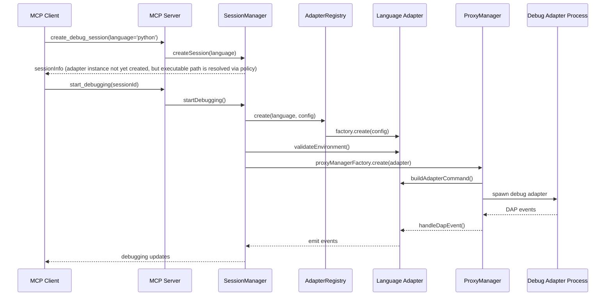

# mcp-debugger Architecture Overview

> **⚠️ DRAFT DOCUMENTATION**  
> This documentation is based on mcp-debugger v0.10.0 architecture and will be refined based on real-world adapter development feedback.

## From Python-Specific to Multi-Language Platform

The mcp-debugger has undergone a major architectural transformation, evolving from a Python-specific debugging tool into a multi-language debugging platform. This refactoring introduced a clean adapter pattern that separates language-agnostic core functionality from language-specific implementations.

## Key Architectural Components

### 1. Language-Agnostic Core

The core components handle session management, process lifecycle, and DAP communication without any language-specific knowledge:

- **[SessionManager](../../src/session/session-manager.ts)** - Thin public facade over the session manager hierarchy (orchestration in `session-manager-operations.ts` and `session-manager-core.ts`)
- **[ProxyManager](../../src/proxy/proxy-manager.ts)** - Manages DAP proxy processes
- **[SessionStore](../../src/session/session-store.ts)** - Persistent session storage

### 2. Debug Adapter Interface

The **[IDebugAdapter](../../packages/shared/src/interfaces/debug-adapter.ts)** interface defines the contract that all language adapters must implement:

```typescript
export interface IDebugAdapter extends EventEmitter {
  readonly language: DebugLanguage;
  readonly name: string;
  
  // Lifecycle
  initialize(): Promise<void>;
  dispose(): Promise<void>;
  
  // Environment validation
  validateEnvironment(): Promise<ValidationResult>;
  resolveExecutablePath(preferredPath?: string): Promise<string>;
  
  // DAP operations
  buildAdapterCommand(config: AdapterConfig): AdapterCommand;
  sendDapRequest<T>(command: string, args?: unknown): Promise<T>;
  handleDapEvent(event: DebugProtocol.Event): void;
  
  // ... 30+ methods total
}
```

### 3. Language Adapters

Each supported language implements the IDebugAdapter interface:

- **[MockDebugAdapter](../../packages/adapter-mock/)** - Reference implementation for testing
- **[PythonDebugAdapter](../../packages/adapter-python/)** - Python/debugpy support
- **[JavascriptDebugAdapter](../../packages/adapter-javascript/)** - JavaScript/Node.js support
- **[RustDebugAdapter](../../packages/adapter-rust/)** - Rust/CodeLLDB support
- **[GoDebugAdapter](../../packages/adapter-go/)** - Go/Delve support
- **[JavaDebugAdapter](../../packages/adapter-java/)** - Java/JDI support
- **[DotnetDebugAdapter](../../packages/adapter-dotnet/)** - .NET/netcoredbg support

### 4. Adapter Registry

The **[AdapterRegistry](../../src/adapters/adapter-registry.ts)** manages available adapters:

```typescript
registry.register('python', new PythonAdapterFactory());
registry.register('mock', new MockAdapterFactory());
// registry.register('javascript', new JavascriptAdapterFactory());
```

## Data Flow Architecture


```mermaid
sequenceDiagram
    participant Client as MCP Client
    participant Server as MCP Server
    participant SM as SessionManager
    participant AR as AdapterRegistry
    participant Adapter as Language Adapter
    participant PM as ProxyManager
    participant DAP as Debug Adapter Process
    
    Client->>Server: create_debug_session(language='python')
    Server->>SM: createSession(language)
    SM-->>Client: sessionInfo (adapter instance not yet created, but executable path is resolved via policy)

    Client->>Server: start_debugging(sessionId)
    Server->>SM: startDebugging()
    SM->>AR: create(language, config)
    AR->>Adapter: factory.create(config)
    SM->>Adapter: validateEnvironment()
    SM->>PM: proxyManagerFactory.create(adapter)
    PM->>Adapter: buildAdapterCommand()
    PM->>DAP: spawn debug adapter
    
    DAP-->>PM: DAP events
    PM-->>Adapter: handleDapEvent()
    Adapter-->>SM: emit events
    SM-->>Client: debugging updates
```

## Key Design Decisions

### 1. Wrap, Don't Rewrite

The existing ProxyManager provides excellent process management. Rather than rewriting it, we inject adapters to handle language-specific concerns:

```typescript
// Before: ProxyManager had Python-specific logic
class ProxyManager {
  private async spawnPythonDebugger() { /* ... */ }
}

// After: ProxyManager delegates to adapters
class ProxyManager {
  constructor(private adapter: IDebugAdapter) {}
  
  private async spawnDebugAdapter() {
    const command = this.adapter.buildAdapterCommand(this.config);
    // ... spawn using command
  }
}
```

### 2. Invariant Core, Variable Adapters

The core remains stable while adapters handle all language-specific variations:

- **Core handles**: Process lifecycle, IPC, session state, DAP transport
- **Adapters handle**: Executable discovery, command building, environment validation, language-specific quirks

### 3. Event-Driven Communication

Adapters extend EventEmitter for loose coupling:

```typescript
adapter.on('stopped', (event) => {
  // Update UI, notify client
});

adapter.on('stateChanged', (oldState, newState) => {
  // Track adapter state transitions
});
```

## Reality Check: Theory vs Practice

### Path Handling Complexity

**Theory**: Adapters handle path translation cleanly
**Reality**: Adapter-facing source-path translation was minimized and largely delegated to the debug adapters. However, path handling still occurs in several places (e.g., proxy script discovery, absolute path resolution for breakpoints, container path resolution via `SimpleFileChecker`/`resolvePathForRuntime`). The approach is to avoid unnecessary cross-platform path manipulation rather than eliminating all path logic.

### State Management

**Theory**: Clean state transitions following VALID_TRANSITIONS
**Reality**: Some adapters use simpler or looser state models than earlier expectations. The mock adapter policy still maintains explicit initialized/configuration state transitions via `createInitialState()`, `updateStateOnCommand()`, and `updateStateOnEvent()`.

### DAP Event Sequences

**Theory**: Simple event flow  
**Reality**: Each debugger has quirks. See [DAP Sequence Reference](../development/dap-sequence-reference.md) for real-world examples:
- Node.js waits for debugger detach
- Python handles sys.exit() specially
- Event ordering matters: `exited` → `terminated`

## Performance Characteristics

The adapter pattern adds minimal overhead:

| Operation | Before | After | Impact |
|-----------|--------|-------|--------|
| Session Creation | 100ms | 105ms | +5% |
| Breakpoint Setting | <10ms | <10ms | None |
| Step Operations | <50ms | <50ms | None |
| Memory per Session | Baseline | +~1MB | Adapter instance |

## Testing Infrastructure

The refactoring improved testability:

- **808 passing tests** (100% success rate)
- **Mock adapter** enables integration testing without external dependencies
- **Type safety** throughout with TypeScript strict mode
- **Comprehensive test coverage** for all components

## Common Pitfalls

### 1. Forgetting Event Registration

Adapters must properly handle DAP events:

```typescript
// ❌ Wrong: Forgetting to update state
handleDapEvent(event: DebugProtocol.Event): void {
  this.emit(event.event, event.body);
}

// ✅ Correct: Update internal state
// Note: Paused execution is primarily modeled at the session/proxy
// orchestration layer. At the adapter level, DEBUGGING indicates
// an active debug session (which may be paused or running).
handleDapEvent(event: DebugProtocol.Event): void {
  if (event.event === 'stopped') {
    this.currentThreadId = event.body?.threadId;
    this.transitionTo(AdapterState.DEBUGGING);
  }
  this.emit(event.event, event.body);
}
```

### 2. Incorrect State Transitions

The `stopped` event means PAUSED, not terminated:

```typescript
// ❌ Wrong: Confusing stopped with terminated
if (event.event === 'stopped') {
  this.state = AdapterState.TERMINATED; // NO!
}

// ✅ Correct: Stopped = paused for debugging
if (event.event === 'stopped') {
  this.state = AdapterState.DEBUGGING; // Paused at breakpoint
}
```

### 3. Missing Terminated Event

Adapters that need to synthesize session-end events (e.g., a mock adapter or one whose underlying runtime does not emit `terminated`) should send both `exited` and `terminated`. When the real debug adapter process sends these events over DAP, ProxyManager forwards them automatically — adapters in that case do not need to emit them manually.

```typescript
// ❌ Wrong: Only sending exited (when synthesizing events manually)
async endSession() {
  this.emit('exited', { exitCode: 0 });
}

// ✅ Correct: Send both exited and terminated (when synthesizing events manually)
async endSession(exitCode: number) {
  this.emit('exited', { exitCode });
  this.emit('terminated');
}
```

## Next Steps

- Read the [Adapter Development Guide](./adapter-development-guide.md) to create your own adapter
- Check the [API Reference](./api-reference.md) for detailed interface documentation
- Review the [Mock Adapter](../../packages/adapter-mock/) as a working example
- See [Migration Guide](../migration-guide.md) for upgrading from older versions

## Version History

- **v0.10.0** - Current architecture with adapter pattern
- **v0.9.x** - Python-specific implementation
- **v0.8.x** - Initial MCP server implementation

---

*This documentation reflects the state of mcp-debugger after the major refactoring completed in January 2025. For the refactoring history, see [refactoring-summary.md](./refactoring-summary.md).*
