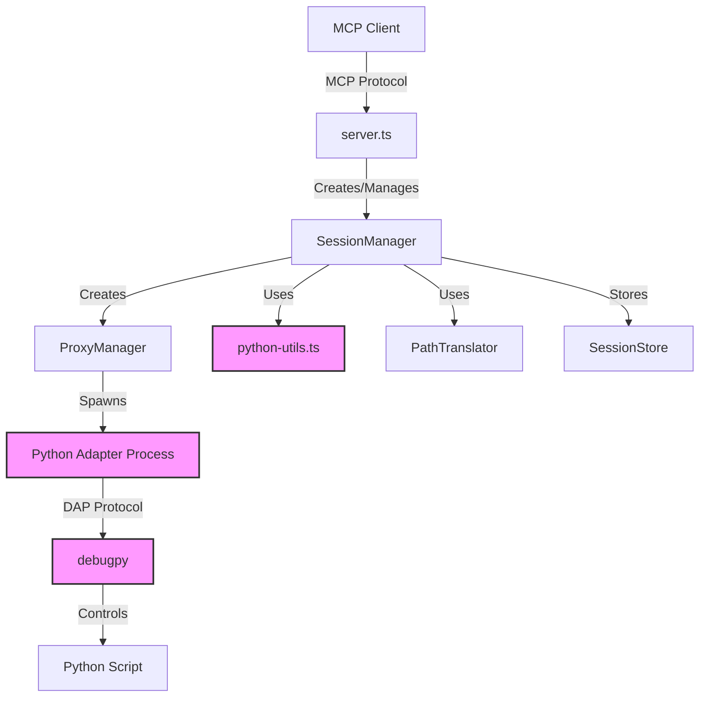
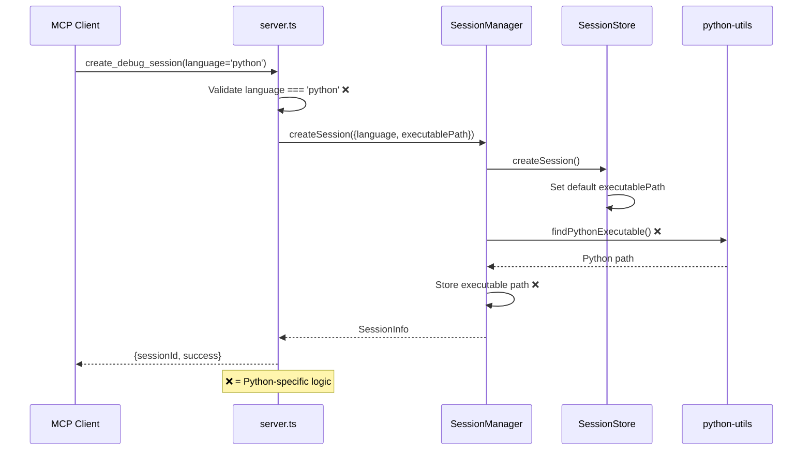
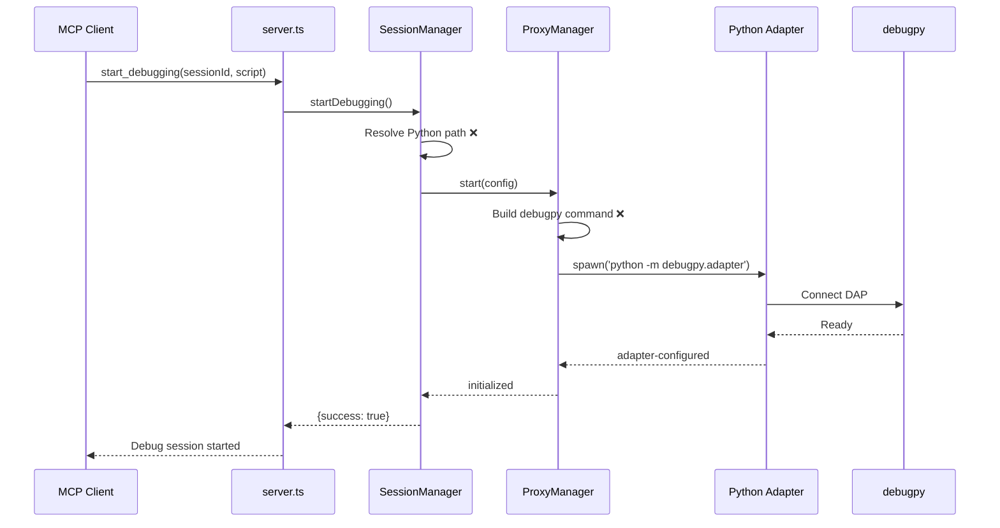
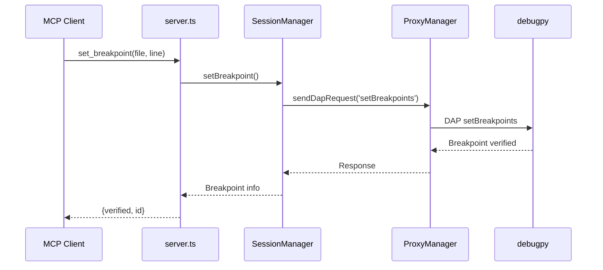
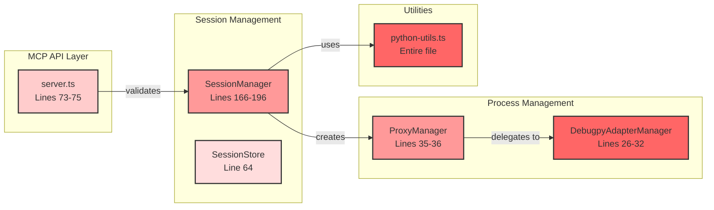
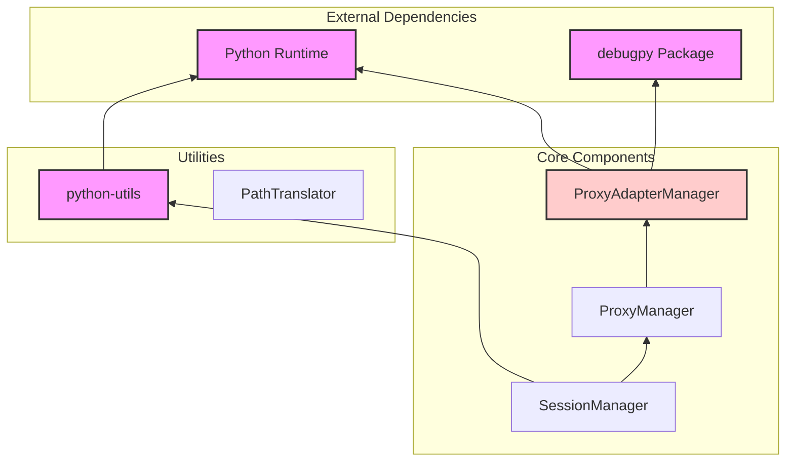
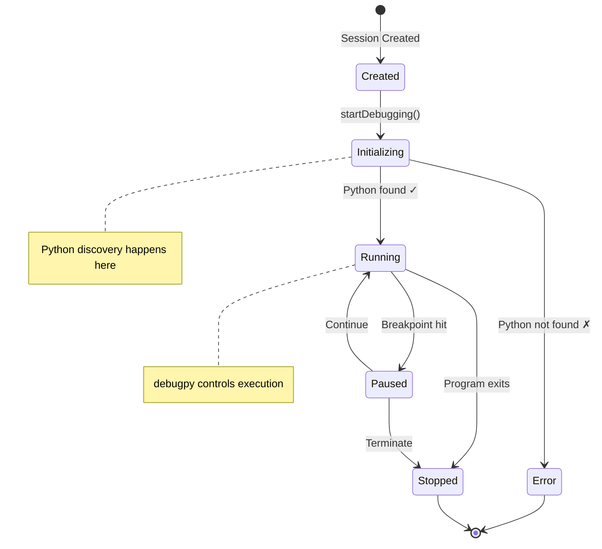

# Current Component Architecture

## System Overview



## Component Responsibilities

| Component | Responsibility | Python Coupling | Refactoring Priority |
|-----------|---------------|-----------------|---------------------|
| **server.ts** | MCP protocol handling, tool registration | LOW - Language validation only | MEDIUM |
| **SessionManager** | Session lifecycle, debugging orchestration | **CRITICAL** - Python path resolution, debugpy assumptions | **HIGH** |
| **ProxyManager** | Process spawning, DAP communication | **CRITICAL** - Hardcoded debugpy commands | **HIGH** |
| **SessionStore** | Session state persistence | LOW - Python defaults | LOW |
| **python-utils.ts** | Python executable discovery | **CRITICAL** - Entirely Python-specific | Keep as-is |
| **PathTranslator** | Container/host path translation | NONE - Language agnostic | NONE |
| **DebugpyAdapterManager** | debugpy process management | **CRITICAL** - debugpy specific | Replace with adapters |

## Session Creation Sequence



## Debug Session Lifecycle



## Breakpoint Setting Flow



## Current Python Coupling Points



## Data Flow Analysis

### Session Creation Data Flow
```
1. Client Request
   └─> language: 'python' (hardcoded enum value)
   └─> executablePath?: string (optional)

2. Server Validation
   └─> if (language !== 'python') throw ❌

3. SessionManager Processing
   └─> Resolve executable path (platform-specific) ❌
   └─> Store in session.executablePath ❌

4. SessionStore
   └─> Default to env.PYTHON_PATH or 'python'/'python3' ❌
```

### Configuration Data Flow
```
ProxyConfig {
  executablePath: string  ❌ Language-specific field
  adapterHost: string
  adapterPort: number
  scriptPath: string
  initialBreakpoints: []
}
```

## Component Dependencies Graph



## Event Flow Patterns

### Current Event Handling


## Key Architecture Insights

### 1. **Proxy Pattern Already Exists**
The system already uses a proxy pattern (ProxyManager → Adapter Process), which is perfect for multi-language support. We just need to make it language-agnostic.

### 2. **Clear Separation Points**
- **Good**: python-utils.ts is isolated
- **Bad**: SessionManager mixes session logic with Python logic
- **Ugly**: ProxyManager hardcodes debugpy commands

### 3. **Single Language Assumption**
The `DebugLanguage` enum having only `PYTHON` means:
- No existing multi-language code to break
- All current code assumes Python
- Clean slate for adapter pattern

### 4. **Event-Driven Architecture**
The system is already event-driven (DAP events), making it easier to abstract language-specific behavior.

## Refactoring Opportunities

### Current Anti-Pattern
```
Client → Server → SessionManager → Python Logic → ProxyManager → debugpy
                          ↓
                    python-utils
```

### Target Architecture
```
Client → Server → SessionManager → IDebugAdapter → Language-Specific Adapter
                                         ↓
                                   AdapterFactory
                                         ↓
                              PythonAdapter / NodeAdapter / etc.
```

## Component Coupling Matrix

| Component | Depends On | Python Coupling | Refactor Difficulty |
|-----------|------------|-----------------|-------------------|
| server.ts | SessionManager | Language validation | LOW |
| SessionManager | python-utils, ProxyManager | Path resolution, config | HIGH |
| ProxyManager | DebugpyAdapterManager | Command building | MEDIUM |
| SessionStore | None (uses defaults) | Default paths | LOW |
| PathTranslator | None | None | NONE |
| python-utils | Python runtime | Entire purpose | N/A (Keep) |

## System Constraints

1. **MCP Protocol**: Fixed interface, must maintain compatibility
2. **DAP Protocol**: Standard debug protocol, language-agnostic
3. **Current Tests**: 50+ tests assume Python behavior
4. **Docker**: No Python installed in container (relies on host)

## Next Steps for Refactoring

1. **Extract IDebugAdapter interface**
2. **Move Python logic from SessionManager to PythonAdapter**
3. **Create AdapterFactory for language selection**
4. **Update ProxyManager to be language-agnostic**
5. **Remove hardcoded language validation from server.ts**
