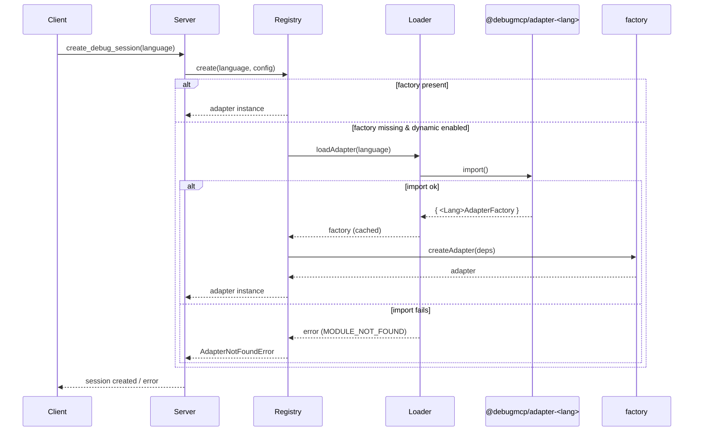

# Dynamic Loading Architecture

Status: v0.15.0  
Scope: Adapter discovery, lazy loading, caching, error handling, and container considerations

## Overview

The mcp-debugger server discovers and loads debug adapters dynamically at runtime instead of compiling them into the core. This makes the core smaller, enables optional adapter installation, and keeps startup time fast while still supporting many languages.

High-level flow:
- Client calls an MCP tool (e.g., create_debug_session)
- SessionManager requests an adapter from AdapterRegistry
- AdapterRegistry uses AdapterLoader to dynamically import the adapter package by language name
- A factory from the adapter package constructs a concrete IDebugAdapter instance
- Instance is cached and reused subject to limits and auto-dispose rules

```mermaid
flowchart LR
  C[MCP Client] -->|Tool Request| SM[SessionManager]
  SM --> R[AdapterRegistry]
  R -->|lazy load| L[AdapterLoader]
  L -->|import()| P[@debugmcp/adapter-<lang>]
  P --> F[<Language>AdapterFactory]
  F --> A[IDebugAdapter]
  A --> R
  R --> SM
  SM --> C
```

## Key Components

### AdapterLoader
- Discovers adapter packages by convention: `@debugmcp/adapter-<language>`
- Primary load path: dynamic `import(packageName)`
- Fallback load paths (URLs relative to bundle):
  - `../node_modules/@debugmcp/adapter-<language>/dist/index.js`
  - `../packages/adapter-<language>/dist/index.js` (monorepo/dev)
- Also tries `createRequire` for CJS/bundled contexts when direct import fails
- Expects a named factory class to exist in the module:
  - Class name pattern: `<CapitalizedLanguage>AdapterFactory`
  - Example: for `python`, `PythonAdapterFactory`
- Caches the constructed factory by language to avoid re-import

```ts
// src/adapters/adapter-loader.ts (summary)
const packageName = `@debugmcp/adapter-${language}`;
const FactoryClass = moduleRef[factoryClassName];
const factory: IAdapterFactory = new FactoryClass();
cache.set(language, factory);
```

### AdapterRegistry
- Keeps a registry of adapter factories and tracks active adapter instances
- Lazy loading is opt-in via config or enabled in containers:
  - `enableDynamicLoading` or `process.env.MCP_CONTAINER === 'true'`
- If a factory is not registered and dynamic is enabled:
  - Calls `AdapterLoader.loadAdapter(language)`
  - Registers the loaded factory and immediately uses it
- Provides:
  - `getSupportedLanguages()` for currently registered factories
  - `listLanguages()` for dynamically installed adapter languages
  - `listAvailableAdapters()` for installed metadata (name, package, description)
- Enforces instance limits and auto-dispose timers

```mermaid
flowchart TD
  subgraph Registry
    RF[Registered Factories] --> Create
    Create --> AA[Active Adapters]
    Create -->|none registered| Lazy
    Lazy --> Load[AdapterLoader.loadAdapter()]
    Load --> RF
  end
```

## Loading Process (Step-by-step)

1) Client calls an MCP tool (e.g., `create_debug_session` with `language = "python"`).
2) `SessionManager` requests an adapter from `AdapterRegistry.create(language, config)`.
3) Registry checks for a registered factory. If not found:
   - If dynamic enabled, it calls `AdapterLoader.loadAdapter(language)`.
   - Otherwise throws `AdapterNotFoundError`.
4) AdapterLoader:
   - Attempts `import('@debugmcp/adapter-python')`.
   - On failure, tries fallback URLs (node_modules, then packages).
   - If still failing, attempts `createRequire` using file URL.
5) On successful import:
   - Extracts `<Language>AdapterFactory` class.
   - Constructs the factory and returns it to registry.
   - Registry runs factory `validate()` (if configured) and registers it.
6) Registry constructs an adapter instance via the factory, initializes it, and returns it.
7) Subsequent requests benefit from in-memory cache (in both Registry and Loader).



## Error Handling

- If the adapter package is not installed:
  - `MODULE_NOT_FOUND` or `ERR_MODULE_NOT_FOUND` is observed
  - AdapterLoader throws a message including a suggested npm install command:
    - `npm install @debugmcp/adapter-<language>`
- If the factory class is not found:
  - Loader throws: `Factory class <Name> not found`
  - Ensure the adapter exports the expected named class
- If registry cannot dynamically load or `enableDynamicLoading` is off:
  - `AdapterNotFoundError(language, availableLanguages)` is thrown

## Performance

- Startup time is unchanged in most cases because adapters are not loaded until needed (lazy).
- First-load vs cached-load:
  - First-load includes Node resolution + module import: typically tens of milliseconds
  - Cached load is near-zero (in-memory map lookup)
- Caching strategy:
  - AdapterLoader caches factory instances by language
  - AdapterRegistry keeps a map of active adapters per language and can auto-dispose idle adapters
- Preloading vs Lazy:
  - Prefer lazy for most cases to keep cold-start minimal
  - You can preload specific adapters by calling `listLanguages()` early (to prime the loader) or constructing sessions on startup if your environment benefits from it

## Container Considerations

- Minimal runtime image includes only Node runtime and Python (for python adapter) – ensure any runtime Node deps needed by adapters are copied. Example:
  - `which` depends on `isexe` at runtime; include both in the image when needed.
- Stdout purity for stdio transport:
  - MCP stdio requires newline-delimited JSON (NDJSON) on stdout
  - A preloader (scripts/stdio-silencer.cjs) silences console methods and mirrors raw stdio to `/app/logs` without altering protocol framing
- Helpful diagnostics:
  - Use `scripts/diagnose-stdio-client.mjs` to connect to the container via stdio and exercise tools
  - Mount `/app/logs` to inspect `stdout-raw.log` and `stdin-raw.log`
- Environment:
  - `MCP_CONTAINER=true` enables dynamic loading automatically in the registry

## Troubleshooting

### Common Errors and Fixes

- MODULE_NOT_FOUND / ERR_MODULE_NOT_FOUND
  - Cause: Adapter package not installed in the current runtime
  - Fix: `npm install @debugmcp/adapter-<language>`, rebuild/redeploy
- Factory class not found
  - Cause: Adapter doesn’t export `<Language>AdapterFactory` as a named class
  - Fix: Ensure `export class <Language>AdapterFactory ...` is present and the default export contains `{ name, factory }` if you expose both
- Adapter not discoverable in container
  - Check that the adapter package and its runtime deps exist in the final runtime image
  - Verify that `which` and `isexe` are both present if used by your adapter
- Connection closed immediately in stdio
  - Typical cause: stdout pollution (non-JSON output)
  - Fix: Ensure no console.log/console.error on startup; use the provided stdio-silencer preloader

### Debugging Tips

- Increase logging:
  - Set your server logs to debug level (via CLI args or env)
  - Run `DEBUG=mcp:*` in your client environment if supported
- Verify adapter presence:
  - `npm ls @debugmcp/adapter-*`
  - Call `list_supported_languages` tool to see what the server reports
- Use the diagnostic client:
  - `node scripts/diagnose-stdio-client.mjs` verifies connect → list → create → close flow

### Troubleshooting Flowchart

```mermaid
flowchart TD
  A[Adapter not loading?] --> B{Is package installed?}
  B -- No --> C[npm install @debugmcp/adapter-<lang>]
  B -- Yes --> D{Factory exported? <Lang>AdapterFactory}
  D -- No --> E[Fix export structure: class + default { name, factory }]
  D -- Yes --> F{Container stdio clean?}
  F -- No --> G[Enable stdio silencer; remove console output]
  F -- Yes --> H[Check /app/logs/stdout-raw.log & stdin-raw.log]
  H --> I{Errors present?}
  I -- Yes --> J[Address specific error; rebuild image]
  I -- No --> K[Call list_supported_languages to verify discovery]
```

## Adapter Package Convention

- Package name: `@debugmcp/adapter-<language>`
- Default export:
  ```ts
  // dist/index.js (compiled)
  export { <Language>AdapterFactory } from './<Language>AdapterFactory.js';
  export default { name: '<language>', factory: <Language>AdapterFactory };
  ```
- Class name must match `<CapitalizedLanguage>AdapterFactory`

## Appendix: Example Loader Error Messages

- `Failed to load adapter for 'python' from package '@debugmcp/adapter-python'. Adapter not installed. Install with: npm install @debugmcp/adapter-python`
- `Failed to load adapter for 'python' from package '@debugmcp/adapter-python'. Error: Factory class PythonAdapterFactory not found in @debugmcp/adapter-python.`
