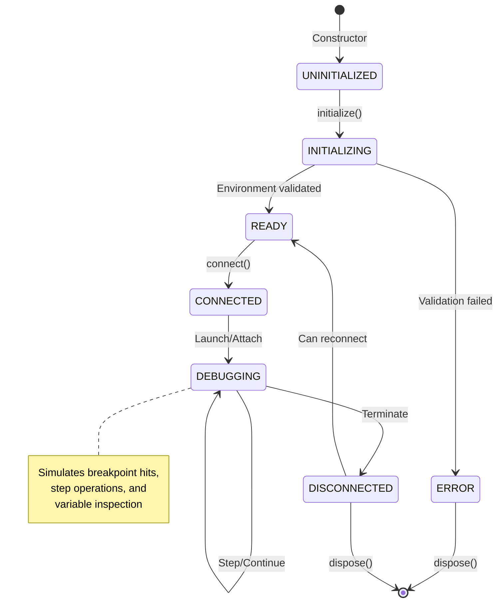

# Mock Debug Adapter Design

## Purpose

The Mock Debug Adapter enables comprehensive testing of the mcp-debugger system without requiring external debuggers or language runtimes. It simulates realistic debugging scenarios while providing deterministic, controllable behavior for testing.

### Key Benefits

1. **Test Isolation**: No external dependencies required
2. **Deterministic Behavior**: Predictable outcomes for reliable tests
3. **Error Simulation**: Test error handling and edge cases
4. **Performance Testing**: Measure adapter overhead without runtime variability
5. **Development Speed**: Test new features before implementing real adapters

## State Machine

The mock adapter follows the standard debug adapter state transitions:



## Simulated Behaviors

### 1. Breakpoint Hits

The mock adapter maintains an internal program counter and simulates hitting breakpoints:

```typescript
interface MockBreakpoint {
  id: string;
  file: string;
  line: number;
  hitCount: number;
  condition?: string;
}

class MockDebugAdapter {
  private breakpoints = new Map<string, MockBreakpoint>();
  private programCounter = { file: 'main.mock', line: 1 };
  
  simulateBreakpointHit(breakpointId: string): void {
    const bp = this.breakpoints.get(breakpointId);
    if (bp) {
      bp.hitCount++;
      this.programCounter = { file: bp.file, line: bp.line };
      this.emit('stopped', {
        reason: 'breakpoint',
        threadId: 1,
        allThreadsStopped: true
      });
    }
  }
}
```

### 2. Variable Inspection

Simulates a variable scope hierarchy with different types:

```typescript
interface MockVariable {
  name: string;
  value: string;
  type: string;
  variablesReference: number;
  children?: MockVariable[];
}

const MOCK_VARIABLES: MockVariable[] = [
  {
    name: 'localVar',
    value: '42',
    type: 'int',
    variablesReference: 0
  },
  {
    name: 'complexObject',
    value: 'Object',
    type: 'object',
    variablesReference: 1001,
    children: [
      { name: 'field1', value: '"hello"', type: 'string', variablesReference: 0 },
      { name: 'field2', value: 'true', type: 'boolean', variablesReference: 0 }
    ]
  },
  {
    name: 'largeArray',
    value: 'Array[1000]',
    type: 'array',
    variablesReference: 1002,
    children: generateMockArray(1000)
  }
];
```

### 3. Step Operations

Simulates different step behaviors:

```typescript
class MockDebugAdapter {
  async stepOver(): Promise<void> {
    await this.simulateDelay(10); // Simulate execution time
    this.programCounter.line++;
    
    // Check if we hit a breakpoint
    const breakpointHit = this.checkBreakpointAt(
      this.programCounter.file, 
      this.programCounter.line
    );
    
    this.emit('stopped', {
      reason: breakpointHit ? 'breakpoint' : 'step',
      threadId: 1
    });
  }
  
  async stepInto(): Promise<void> {
    await this.simulateDelay(15);
    // Simulate entering a function
    this.callStack.push({
      id: this.callStack.length,
      name: `mockFunction${this.callStack.length}`,
      file: 'mock-lib.mock',
      line: 1
    });
    this.programCounter = { file: 'mock-lib.mock', line: 1 };
    this.emit('stopped', { reason: 'step', threadId: 1 });
  }
  
  async stepOut(): Promise<void> {
    await this.simulateDelay(20);
    // Simulate returning from function
    if (this.callStack.length > 1) {
      this.callStack.pop();
      const caller = this.callStack[this.callStack.length - 1];
      this.programCounter = { file: caller.file, line: caller.line + 1 };
    }
    this.emit('stopped', { reason: 'step', threadId: 1 });
  }
}
```

### 4. Error Scenarios

Simulates various error conditions:

```typescript
enum MockErrorScenario {
  NONE = 'none',
  EXECUTABLE_NOT_FOUND = 'executable_not_found',
  ADAPTER_CRASH = 'adapter_crash',
  CONNECTION_TIMEOUT = 'connection_timeout',
  INVALID_BREAKPOINT = 'invalid_breakpoint',
  SCRIPT_ERROR = 'script_error',
  OUT_OF_MEMORY = 'out_of_memory'
}

class MockDebugAdapter {
  private errorScenario: MockErrorScenario = MockErrorScenario.NONE;
  
  setErrorScenario(scenario: MockErrorScenario): void {
    this.errorScenario = scenario;
  }
  
  async validateEnvironment(): Promise<ValidationResult> {
    if (this.errorScenario === MockErrorScenario.EXECUTABLE_NOT_FOUND) {
      return {
        valid: false,
        errors: [{
          code: 'MOCK_NOT_FOUND',
          message: 'Mock executable not found',
          recoverable: false
        }],
        warnings: []
      };
    }
    return { valid: true, errors: [], warnings: [] };
  }
  
  async connect(host: string, port: number): Promise<void> {
    if (this.errorScenario === MockErrorScenario.CONNECTION_TIMEOUT) {
      await this.simulateDelay(5000);
      throw new AdapterError(
        'Connection timeout',
        AdapterErrorCode.CONNECTION_TIMEOUT,
        true
      );
    }
    // Normal connection
    await this.simulateDelay(50);
    this.setState(AdapterState.CONNECTED);
  }
}
```

## Test Scenarios

### Scenario 1: Basic Debugging Flow
```typescript
const scenario: MockScenario = {
  name: 'basic-debugging',
  steps: [
    { action: 'setBreakpoint', args: { file: 'main.mock', line: 5 } },
    { action: 'launch', args: { script: 'main.mock' } },
    { action: 'waitForStop', expected: { reason: 'entry' } },
    { action: 'continue' },
    { action: 'waitForStop', expected: { reason: 'breakpoint', line: 5 } },
    { action: 'stepOver' },
    { action: 'waitForStop', expected: { reason: 'step', line: 6 } },
    { action: 'continue' },
    { action: 'waitForTerminate' }
  ]
};
```

### Scenario 2: Variable Inspection
```typescript
const scenario: MockScenario = {
  name: 'variable-inspection',
  steps: [
    { action: 'launch', args: { script: 'variables.mock', stopOnEntry: true } },
    { action: 'waitForStop' },
    { action: 'getStackTrace', expected: { frameCount: 3 } },
    { action: 'getScopes', args: { frameId: 0 } },
    { action: 'getVariables', args: { variablesReference: 1000 } },
    { action: 'expandVariable', args: { name: 'complexObject' } },
    { action: 'getVariables', args: { variablesReference: 1001 } }
  ]
};
```

### Scenario 3: Error Handling
```typescript
const scenario: MockScenario = {
  name: 'error-handling',
  steps: [
    { action: 'setErrorScenario', args: { scenario: 'connection_timeout' } },
    { action: 'launch', args: { script: 'main.mock' } },
    { action: 'expectError', expected: { code: 'CONNECTION_TIMEOUT' } },
    { action: 'clearErrorScenario' },
    { action: 'launch', args: { script: 'main.mock' } },
    { action: 'waitForStop' }
  ]
};
```

### Scenario 4: Performance Testing
```typescript
const scenario: MockScenario = {
  name: 'performance-test',
  steps: [
    { action: 'setBreakpoints', args: { count: 100 } },
    { action: 'launch', args: { script: 'perf.mock' } },
    { action: 'measureTime', label: 'startup' },
    { action: 'stepOver', repeat: 1000 },
    { action: 'measureTime', label: 'thousand-steps' },
    { action: 'getVariables', args: { largeObject: true } },
    { action: 'measureTime', label: 'large-variables' }
  ]
};
```

## Configuration

The mock adapter can be configured through environment variables or constructor options:

```typescript
interface MockAdapterConfig {
  // Timing configuration
  defaultDelay?: number;        // Base delay for operations (ms)
  connectionDelay?: number;     // Delay for connect operation
  stepDelay?: number;          // Delay for step operations
  
  // Behavior configuration
  supportedFeatures?: DebugFeature[];  // Which DAP features to support
  maxVariableDepth?: number;           // How deep variable trees can go
  maxArrayLength?: number;             // Maximum array size to simulate
  
  // Error simulation
  errorProbability?: number;    // Random error chance (0-1)
  errorScenarios?: MockErrorScenario[]; // Enabled error scenarios
  
  // Performance simulation
  cpuIntensive?: boolean;       // Simulate CPU-intensive operations
  memoryIntensive?: boolean;    // Simulate memory pressure
}

// Usage
const mockAdapter = new MockDebugAdapter({
  defaultDelay: 5,
  supportedFeatures: [
    DebugFeature.CONDITIONAL_BREAKPOINTS,
    DebugFeature.FUNCTION_BREAKPOINTS
  ],
  maxVariableDepth: 10,
  errorProbability: 0.1  // 10% chance of random errors
});
```

## Mock Adapter Process

The mock adapter includes a separate process script that simulates a real debug adapter:

```typescript
// src/adapters/mock/mock-adapter-process.ts
import { createServer } from 'net';

const server = createServer((socket) => {
  const protocol = new MockDebugProtocol(socket);
  
  protocol.on('initialize', async (args) => {
    await simulateDelay(10);
    protocol.sendResponse({
      capabilities: {
        supportsConfigurationDoneRequest: true,
        supportsConditionalBreakpoints: true,
        supportsFunctionBreakpoints: false
      }
    });
  });
  
  protocol.on('launch', async (args) => {
    // Simulate launching a program
    await simulateDelay(50);
    protocol.sendEvent('initialized');
    
    if (args.stopOnEntry) {
      protocol.sendEvent('stopped', {
        reason: 'entry',
        threadId: 1
      });
    }
  });
});

server.listen(port, host);
```

## Testing with Mock Adapter

### Unit Test Example
```typescript
describe('MockDebugAdapter', () => {
  let adapter: MockDebugAdapter;
  
  beforeEach(() => {
    adapter = new MockDebugAdapter({
      defaultDelay: 0  // No delays in tests
    });
  });
  
  it('should simulate breakpoint hit', async () => {
    await adapter.initialize();
    
    const breakpoint = await adapter.setBreakpoint('test.mock', 10);
    expect(breakpoint.verified).toBe(true);
    
    const stopPromise = waitForEvent(adapter, 'stopped');
    adapter.simulateBreakpointHit(breakpoint.id);
    
    const event = await stopPromise;
    expect(event.reason).toBe('breakpoint');
  });
});
```

### Integration Test Example
```typescript
describe('SessionManager with MockAdapter', () => {
  it('should handle full debugging session', async () => {
    const registry = new AdapterRegistry();
    registry.register('mock', new MockAdapterFactory());
    
    const sessionManager = new SessionManager({ adapterRegistry: registry });
    const session = await sessionManager.createSession({
      language: 'mock',
      name: 'Test Session'
    });
    
    const result = await sessionManager.startDebugging(
      session.id,
      'test.mock',
      [],
      { stopOnEntry: true }
    );
    
    expect(result.success).toBe(true);
    expect(session.state).toBe(SessionState.PAUSED);
  });
});
```

## Performance Characteristics

The mock adapter provides consistent performance for benchmarking:

| Operation | Mock Time | Real Python Time | Notes |
|-----------|-----------|------------------|-------|
| Initialize | 10ms | 80-120ms | Mock is predictable |
| Set Breakpoint | 1ms | 5-10ms | No file I/O |
| Step Operation | 5ms | 20-50ms | Configurable delay |
| Get Variables | 2ms | 10-100ms | Depends on object size |
| Launch | 50ms | 200-500ms | No process spawn |

## Future Enhancements

1. **Scenario Recording**: Record real debugging sessions and replay with mock
2. **Chaos Testing**: Introduce random failures and timing variations
3. **Protocol Fuzzing**: Test protocol handling with malformed messages
4. **Load Testing**: Simulate hundreds of concurrent sessions
5. **Visual Debugger**: Web UI to visualize mock adapter state

## Conclusion

The Mock Debug Adapter is a crucial component for:
- Rapid development and testing
- Ensuring consistent test results
- Testing error conditions safely
- Performance benchmarking
- Developer onboarding

It provides a complete simulation of debugging behavior without external dependencies, making the test suite fast, reliable, and comprehensive.
