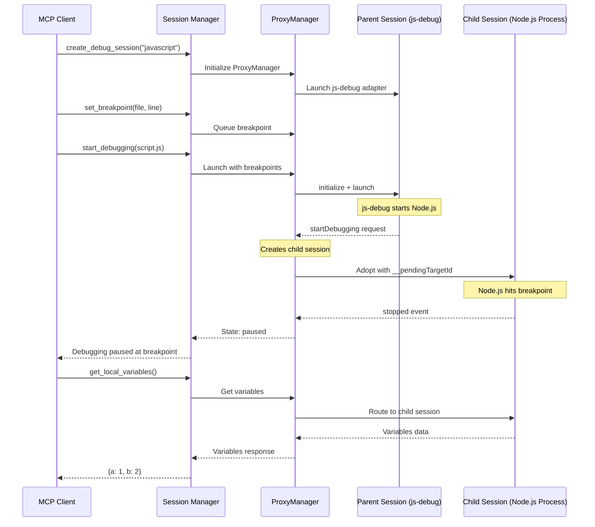

# JavaScript Adapter Architecture Diagram

## Multi-Session Debugging Flow



## Component Relationships

```
┌─────────────────────────────────────────────────────────────┐
│                       MCP Debugger Server                   │
├─────────────────────────────────────────────────────────────┤
│                                                             │
│  ┌─────────────────┐                                        │
│  │ Session Manager │                                        │
│  └────────┬────────┘                                        │
│           │                                                 │
│  ┌────────▼────────┐                                        │
│  │  ProxyManager   │ ◄─── Manages DAP communication         │
│  └────────┬────────┘                                        │
│           │                                                 │
│  ┌────────▼──────────────────────────── ┐                   │
│  │    JavaScript Adapter                │                   │
│  │  ┌────────────────────────────┐      │                   │
│  │  │  ChildSessionManager       │      │                   │
│  │  │  - Handles startDebugging  │      │                   │
│  │  │  - Routes commands         │      │                   │
│  │  └────────────────────────────┘      │                   │
│  └──────────────────────────────────────┘                   │
│                                                             │
└─────────────────────────────────────────────────────────────┘
                            │
                            ▼
┌─────────────────────────────────────────────────────────────┐
│                    js-debug (VSCode)                        │
├─────────────────────────────────────────────────────────────┤
│                                                             │
│  ┌─────────────────┐        ┌─────────────────┐             │
│  │  Parent Session │───────▶│  Child Session │             │
│  │  (Initialization)│       │  (Debug Target) │             │
│  └─────────────────┘        └─────────────────┘             │
│                                      │                      │
│                                      ▼                      │
│                            ┌─────────────────┐              │
│                            │   Node.js       │              │
│                            │   Process       │              │
│                            └─────────────────┘              │
└─────────────────────────────────────────────────────────────┘
```

## Key Components

### 1. ProxyManager
- Manages IPC communication with js-debug process
- Handles DAP protocol translation
- Manages request/response tracking

### 2. ChildSessionManager
- Detects and adopts child sessions via `__pendingTargetId`
- Routes commands between parent and child sessions
- Maintains session state synchronization

### 3. Parent Session
- Handles adapter initialization
- Manages launch configuration
- Creates child process for debugging

### 4. Child Session
- Actual debugging target (Node.js process)
- Handles breakpoints, stepping, and variable inspection
- Sends events back through the chain

## Message Flow Examples

### Setting a Breakpoint
```
Client → SessionManager → ProxyManager → Parent → Child → Node.js
```

### Getting Variables
```
Client → SessionManager → ProxyManager → ChildSessionManager → Child → Node.js
                                              ↑
                                    (Routes to active child)
```

### Stepping Through Code
```
Client → SessionManager → ProxyManager → Child → Node.js
                              ↑
                    (Direct routing after adoption)
```

## Implementation Notes

1. **Session Adoption**: The key innovation is detecting when js-debug creates a child session and adopting it seamlessly.

2. **Command Routing**: Commands are intelligently routed based on session state:
   - Initialization commands → Parent session
   - Debugging commands → Child session

3. **Event Propagation**: Events from the child session bubble up through the ProxyManager to the client.

4. **Vendor Management**: The js-debug vendored files are carefully managed to avoid conflicts and minimize bundle size.

## Future Enhancements

- **Chrome Debugging**: Add `chrome-pwa` adapter support
- **Remote Debugging**: Support attaching to remote Node.js processes
- **Workspace Support**: Handle multi-root workspaces
- **Source Map Improvements**: Enhanced TypeScript source map resolution
