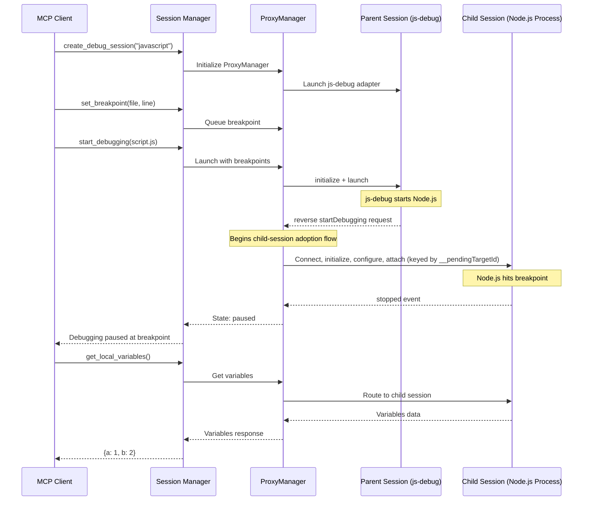

# JavaScript Adapter Architecture Diagram

## Multi-Session Debugging Flow


```mermaid
sequenceDiagram
    participant Client as MCP Client
    participant SM as Session Manager
    participant PM as ProxyManager
    participant Parent as Parent Session (js-debug)
    participant Child as Child Session (Node.js Process)
    
    Client->>SM: create_debug_session("javascript")
    SM->>PM: Initialize ProxyManager
    PM->>Parent: Launch js-debug adapter
    
    Client->>SM: set_breakpoint(file, line)
    SM->>PM: Queue breakpoint
    
    Client->>SM: start_debugging(script.js)
    SM->>PM: Launch with breakpoints
    PM->>Parent: initialize + launch
    
    Note over Parent: js-debug starts Node.js
    Parent-->>PM: reverse startDebugging request
    Note over PM: Begins child-session adoption flow
    PM->>Child: Connect, initialize, configure, attach (keyed by __pendingTargetId)
    
    Note over Child: Node.js hits breakpoint
    Child-->>PM: stopped event
    PM-->>SM: State: paused
    SM-->>Client: Debugging paused at breakpoint
    
    Client->>SM: get_local_variables()
    SM->>PM: Get variables
    PM->>Child: Route to child session
    Child-->>PM: Variables data
    PM-->>SM: Variables response
    SM-->>Client: {a: 1, b: 2}
```

## Component Relationships

```
┌─────────────────────────────────────────────────────────────┐
│                       MCP Debugger Server                   │
├─────────────────────────────────────────────────────────────┤
│                                                             │
│  ┌─────────────────┐                                        │
│  │ Session Manager │                                        │
│  └────────┬────────┘                                        │
│           │                                                 │
│  ┌────────▼────────┐                                        │
│  │  ProxyManager   │ ◄─── Manages DAP communication         │
│  └────────┬────────┘                                        │
│           │                                                 │
│  ┌────────▼──────────────────────────── ┐                   │
│  │    Proxy Layer                       │                   │
│  │  ┌────────────────────────────┐      │                   │
│  │  │  ChildSessionManager       │      │                   │
│  │  │  (src/proxy/)              │      │                   │
│  │  │  - Handles startDebugging  │      │                   │
│  │  │  - Routes commands         │      │                   │
│  │  │  - Event bridging          │      │                   │
│  │  └────────────────────────────┘      │                   │
│  └──────────────────────────────────────┘                   │
│                                                             │
└─────────────────────────────────────────────────────────────┘
                            │
                            ▼
┌─────────────────────────────────────────────────────────────┐
│                    js-debug (VSCode)                        │
├─────────────────────────────────────────────────────────────┤
│                                                             │
│  ┌─────────────────┐        ┌─────────────────┐             │
│  │  Parent Session │───────▶│  Child Session │             │
│  │  (Initialization)│       │  (Debug Target) │             │
│  └─────────────────┘        └─────────────────┘             │
│                                      │                      │
│                                      ▼                      │
│                            ┌─────────────────┐              │
│                            │   Node.js       │              │
│                            │   Process       │              │
│                            └─────────────────┘              │
└─────────────────────────────────────────────────────────────┘
```

## Key Components

### 1. ProxyManager
- Launches and manages the proxy process lifecycle
- Routes IPC messages and DAP request/response correlation around the spawned proxy
- Coordinates adapter launch synchronization
- Manages request/response tracking with timeouts

### 2. ChildSessionManager
Located in `src/proxy/child-session-manager.ts` (proxy layer, not JavaScript adapter internal). Supports only one active child session at a time.
- Detects and adopts child sessions via `__pendingTargetId`
- Routes commands between parent and child sessions
- Coordinates connection, DAP handshake, configuration replay, attach retry, and event bridging
- Tracks active child session for command routing

### 3. Parent Session
- Handles adapter initialization
- Manages launch configuration
- Triggers adapter-created child targets via reverse `startDebugging` requests, which the proxy/client layer then adopts

### 4. Child Session
- Actual debugging target (Node.js process)
- Handles breakpoints, stepping, and variable inspection
- Sends events back through the chain

## Message Flow Examples

### Setting a Breakpoint
```
Client → SessionManager → ProxyManager → Parent (breakpoints set on parent session)
                                              ↓
                                    mirrorBreakpointsToChild → Child
```
Note: Breakpoints are NOT child-routed. They are set on the parent session and then mirrored to the child session via `mirrorBreakpointsToChild`.

### Getting Variables
```
Client → SessionManager → ProxyManager → ChildSessionManager → MinimalDapClient → Child → Node.js
                                              ↑
                                    (Routed via MinimalDapClient to active child)
```

### Stepping Through Code
```
Client → SessionManager → ProxyManager → ChildSessionManager → MinimalDapClient → Child → Node.js
                                              ↑
                                    (Routed via MinimalDapClient to active child)
```

## Implementation Notes

1. **Session Adoption**: The key innovation is detecting when js-debug issues a reverse `startDebugging` request and then running a multi-step adoption flow: connect child client, initialize, configure, attach (with retries), post-attach initialization, and optional stop enforcement.

2. **Command Routing**: Commands are routed based on the adapter policy's `dapBehavior.childRoutedCommands` set. Commands listed in `childRoutedCommands` (e.g., stepping, variables) are sent to the child session; all other commands go to the parent session. Breakpoints are NOT child-routed -- they are set on the parent session and then mirrored to the child session via `mirrorBreakpointsToChild`.

3. **Event Propagation**: Events from the child session bubble up through the ProxyManager to the client.

4. **Vendor Management**: The js-debug vendored files are carefully managed to avoid conflicts and minimize bundle size.

## Future Enhancements

- **Browser Debugging**: Add Chrome/browser debugging support (the current adapter uses `pwa-node` for Node.js)
- **Remote Debugging**: Support attaching to remote Node.js processes
- **Workspace Support**: Handle multi-root workspaces
- **Source Map Improvements**: Enhanced TypeScript source map resolution
